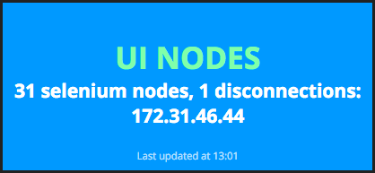

# aws-selenium

Python reporter, finds existing Selenium slaves and tests their connection with the grid's API

Finds AWS nodes based on ASG name, compares with Selenium Grid API based on IPs and sends summary to dashing.

